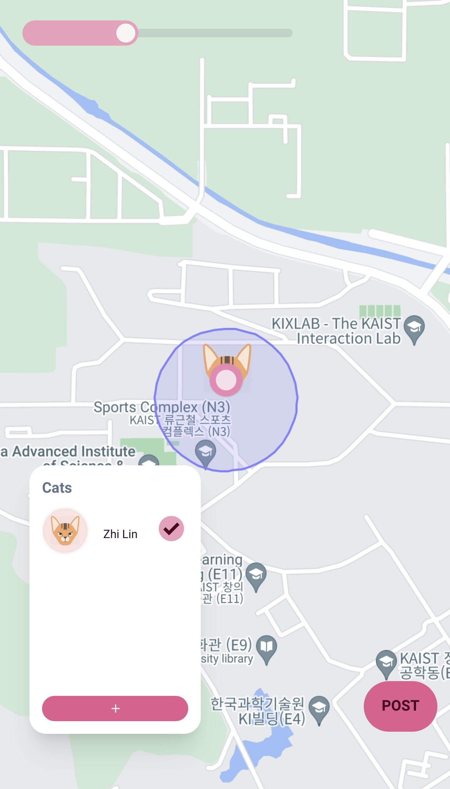
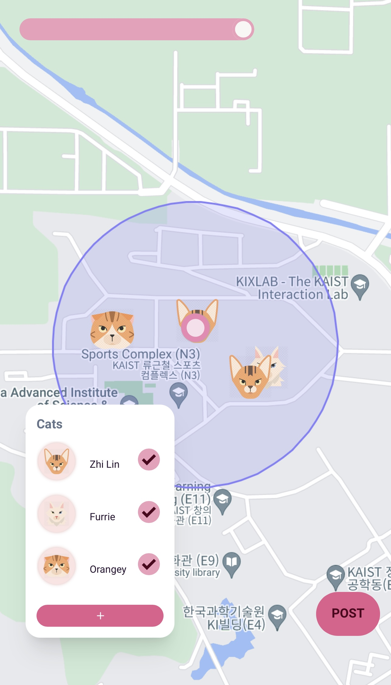
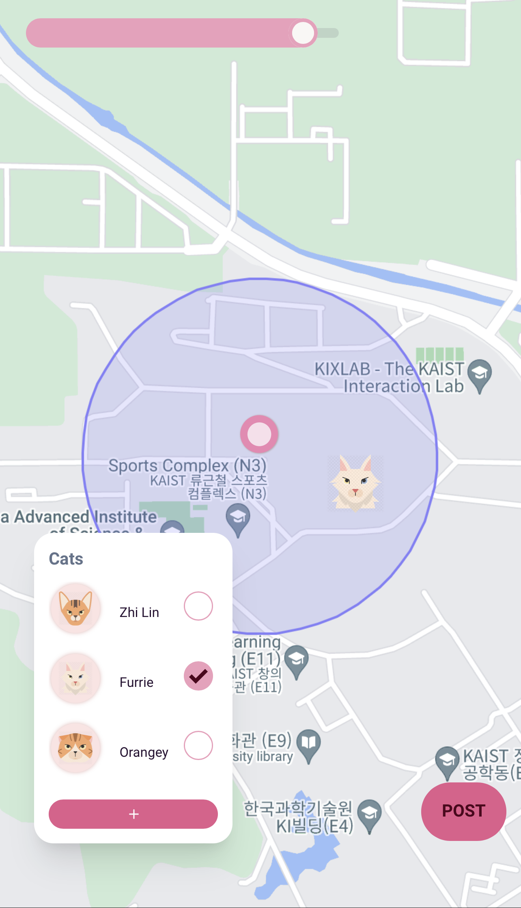
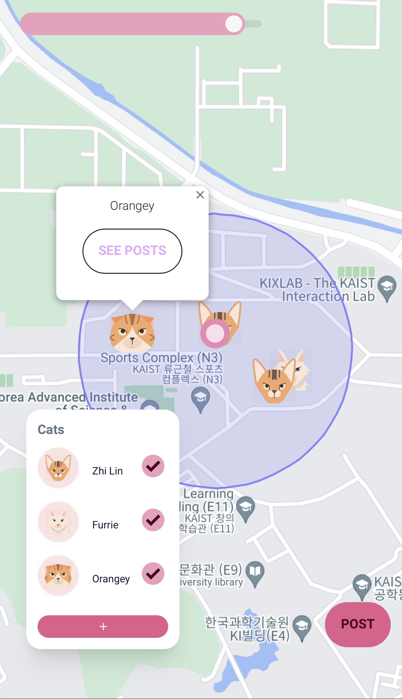
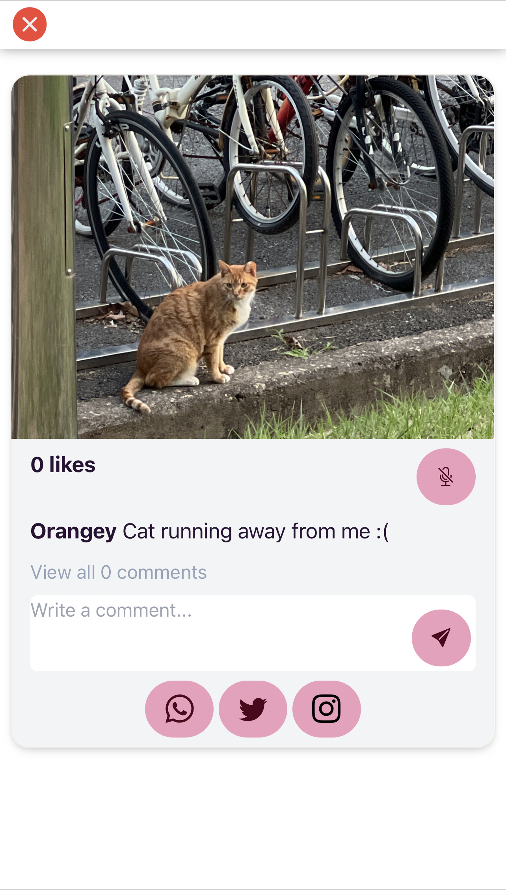
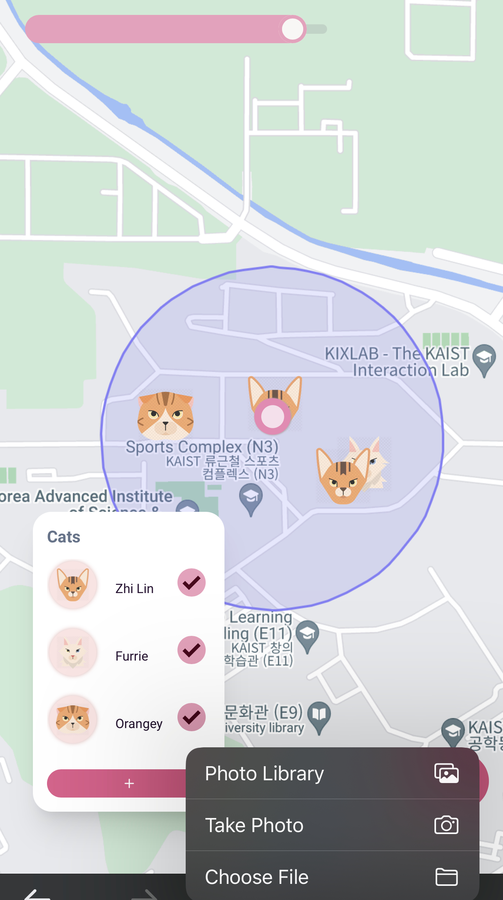
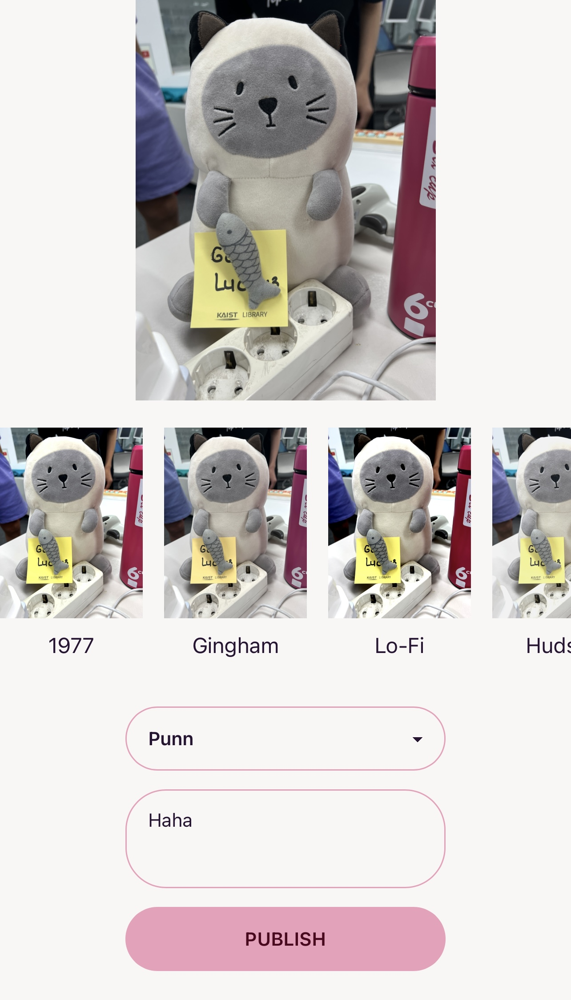
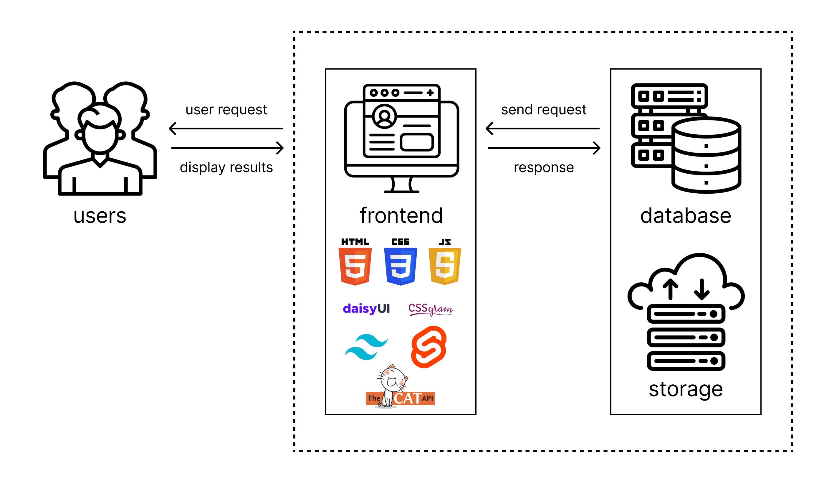

# ID311 Final Project: CattyMap
### **Team members:** 
Damir Zhumatayev  
Punn Lertjaturaphat  
Zhi Lin Yap  
### **Git Repository:**
[CattyMap Git Repository](https://github.com/dameekoh/cattymap)
### **Demo:**
[CattyMap App](https://cattymap.netlify.app)
### **Video link:**
[CattyMap Video](https://youtu.be/4DXybB-FLaQ)

___
## Description 
Our platform provides users with the opportunity to share cat pictures while also identifying the locations where those pictures were taken. Essentially, it can be described as a social media platform specifically designed for cats.

### **Interactions:**
- Users can sign up for an account or log in to an existing account.   
- Users have the flexibility to customize the range within which they prefer to view the cats.  
  
    
- Users can filter the cats they want to see.  
  
- Users can click on the cat and see the posts of that cat.  
  
  
- Users can share those photos to Whatsapp, Twitter and Instagram.  
- Users can double click or says *"meow"* to like a post.  
- Users can comment on posts. 
- Users can post pictures! Please post a picture of a *real* cat, choose a filter, and write something nice.  
  
  

## Main Architecture  

  

1. Front-end 
   - HTML 
   - CSS
   - SvelteKit 
   - DaisyUI
   - Tailwind
   - CSSgram
   - Cat As A Service
   - Javascript
2. Back-end 
   - Firebase Realtime Database 
   - Firebase Storage
   - Firebase Authentication 
3. API
   - GoogleMap API  
   - navigator.geolocation API
  
## Logical Components  
### In /src/lib, 
- GoogleMap.svelte 
  + Map and Markers 
    - Using *GoogleMap API*
    - Fetch cat posts data from *Firebase Realtime Database* and show their avatars as markers 
  + CatsWithinRange feature implemented
    - *CSS* slider 
    - Find distance between user's location and cats' posts location and check if they are within the radius specified. 
- LedgerProfile.svelte
  + Here is where we make the legend component 
- LogIn.svelte 
  + We use *Firebase Email and Password Authentication*
- Posts.svelte
  + Our post component
  + Fetch posts from *Firebase Realtime Database*
  + Update likes and comments to *Firebase Realtime database*

### In /src/routes,
- postPic > +page.svelte
  + Use CSSgram for filters 
  + Send image to *Firebase Storage*, get its link and send to *Firebase Realtime Database*
- propose > +page.svelte 
  + Here is where we allow users to propose new cats.
- +page.svelte
  + Here is where we render our feed.

## Work Distribution  
| Features      | Contributor |
| ----------- | ----------- |
| Sign up/log in Frontend     | Damir       |
| Google Map | Punn      |
| Location Tracking | Punn      |
| Cats Within Range| Punn and Zhi Lin     |
| Legend and Filter| Punn and Zhi Lin     |
| Posting Pic Feature | Damir      |
| Feed | Damir and Zhi Lin     |
| Backend ( Database and Storage ) |  Zhi Lin     |

## Main Challenges and How We Overcame Them
- Making sure that cats within range and cats on legend changes according to users' location when they are moving. 
  + Solution: Take advantage of the reactivity in Svelte, where they automatically update the DOM based on the changes to the state variables.
- Dynamic app updates based on user interactions.
  + Solution: Use onValue when we fetch from database 
- Making a multi-page app in SvelteKit. 
  + Solution: We learned it! 
- Promises and asynchronous functions can be confusing. 
  + Solution: We understand it better now, but sometimes we have to go through trial and error. 
- Have difficulties uploading pictures to Firebase 
  + Solution: We cannot upload pictures to Firebase using the school WiFi. 
- Had a hard time styling the application to how we want it to look like 

## New things learnt 
- navigator.geolocation API 
  + Tracking location of user
- Firebase 
  + Send, fetch and query database 
  + Save pictures to storage 
- GoogleMap API  
  + Set and remove markers on map 
- SvelteKit 